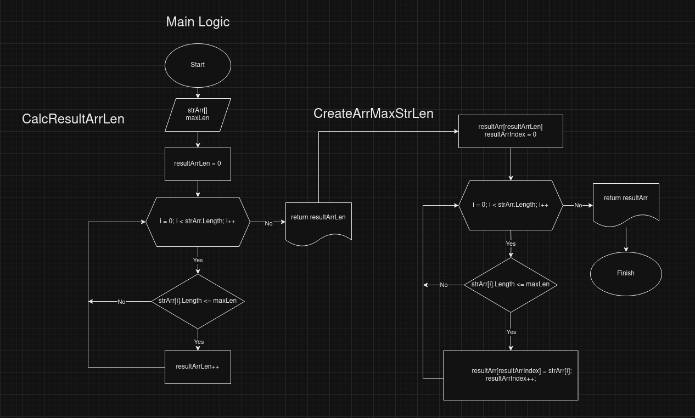

# Контрольная работа по основному блоку GB

## Диаграмма основного алгоритма:


## Главная идея
Неизвестно, сколько элементов исходного массива удовлетворяют условию, так что невозможно наперед знать размер нового массива.
Мы не можем создать массив, не зная его длину. Поэтому мы сначала считаем длину массива, а потом создаем его и заполняем подходящими значениями.

## Описание работы
Логика программы реализована на двух основных функциях: `CalcResultArrLen` и `CreateArrMaxStrLen`.
Первая проходится по элементам исходного массива, и если длина строки меньше или равна максимально допустимой, то переменная длины нового массива инкрементируется. После прохода всего массива возвращается итоговая длина:
```
int CalcResultArrLen(string[] strArr, int maxLen)
{
    int resultArrLen = 0;
    for(int i = 0; i < strArr.Length; i++)
    {
        if(strArr[i].Length <= maxLen)
            resultArrLen++;
    }
    return resultArrLen;
}
```
Вторая функция `CreateArrMaxStrLen` создает новый массив на основе посчитанной длины, после чего заново проходится по исходному массиву, и если элемент подходит под условие, то он добавляется в новый массив:
```
string[] CreateArrMaxStrLen(string[] strArr, int maxLen)
{
    int resultArrLen = CalcResultArrLen(inputStringArr, maxLength);
    string[] resultArr = new string[resultArrLen];
    int resultArrIndex = 0;

    for(int i = 0; i < strArr.Length; i++)
    {
        if(strArr[i].Length <= maxLen)
        {
            resultArr[resultArrIndex] = strArr[i];
            resultArrIndex++;
        }
    }
    return resultArr;
}
```
